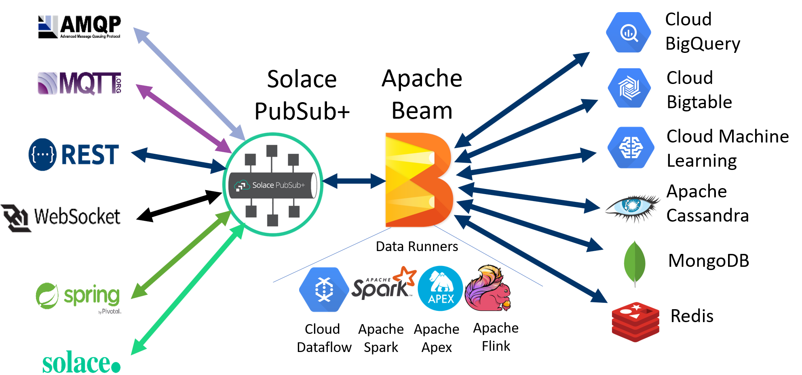
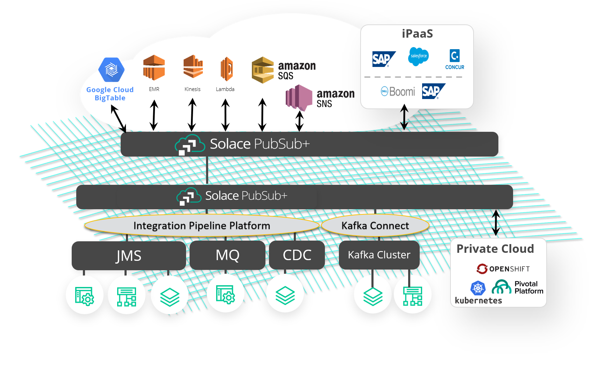

[](https://travis-ci.org/SolaceProducts/solace-apache-beam)

# Apache Beam Solace PubSub+ I/O

## Overview

This repository provides a solution which allows applications connected to a Solace Event Mesh to interop with the Apache Beam SDK and it's as a service offering Google Cloud Dataflow.

## Table of contents
* [Synopsis](#synopsis)
* [Design](#design)
* [Usage](#usage)
* [Sample Walkthrough](#sample-walkthrough)
* [Contributing](#contributing)
* [Authors](#authors)
* [License](#license)
* [Resources](#resources)
---

## Synopsis

Consider the following diagram:



It does not matter if the application communicates with the Solace PubSub+ broker (Appliances, Software and SolaceCloud) via a REST POST or AMQP, JMS or MQTT message, it can be sent streaming to Apache Beam for further processing by it's data runners and further on to other IO connectors such as BigQuery or Apache Cassandra, etc.

The Solace Event Mesh is a clustered group of Solace PubSub+ Brokers that transparently, in real-time, route data events to any Service that is part of the Event Mesh.  Solace PubSub+ Brokers are connected to each other as a multi-connected mesh that to individual services (consumers or producers of data events) appears to be a single Event Broker. Event messages are seamlessly transported within the entire Solace Event Mesh regardless of where the event is created and where the process exists that has registered interested in consuming the event. You can read move about the advantages of a Solace event mesh [here.](https://cloud.solace.com/learn/group_howto/ght_event_mesh.html)

Simply by having a Beam connected Solace PubSub+ broker added to the Event Mesh, the entire Event Mesh becomes aware of the data registration request and will know how to securely route the appropriate events to and from Beam Connected services.

To understand the Beam architecture of source and sink IO connectors and runners please review [Beam Documentation.](https://beam.apache.org/documentation/)

To understand the capabilities of different Beam runners please review the [runner compatibility matrix.](https://beam.apache.org/documentation/runners/capability-matrix/) 

This Beam integration solution allows any event from any service in the Solace Event Mesh [to be captured in:](https://beam.apache.org/documentation/io/built-in/)
* Google BigQuery
* Google Cloud Bigtable
* Google Cloud Datastore
* Google Cloud Spanner
* Apache Cassandra
* Apache Hadoop InputFormat
* Apache HBase
* Apache Hive (HCatalog)
* Apache Kudu
* Apache Solr
* Elasticsearch (v2.x, v5.x, v6.x)
* JDBC
* MongoDB
* Redis
* Amazon Kinesis
* File
* Avro Format

It does not matter which service in the Event Mesh created the event, the events are all potentially available to Beam-connected services. There is no longer a requirement to code end applications to reach individual data services.



## Design

The SolaceIO connector is an UnboundedSource connector providing an infinite data stream.  The connector will connect to a single Solace PubSub+ message broker, bind to and read from a list of [Solace Queues](https://docs.solace.com/Features/Endpoints.htm#Queues).  Each queue binding is a slice for the runner and can be read in parallel.  Messages are acknowledged and deleted from Solace in batches as each checkpoint is committed (client acks). 

## Usage

### Updating Your Build

The releases from this project are hosted in [Maven Central](https://mvnrepository.com/artifact/com.solace.connector.beam/beam-sdks-java-io-solace).

Here is how to include the SolaceIO connector in your project using Gradle and Maven.

#### Using it with Gradle
```groovy
// Apache Beam Solace PubSub+ I/O
compile("com.solace.connector.beam:beam-sdks-java-io-solace:1.0.+")
```

#### Using it with Maven
```xml
<!-- Apache Beam Solace PubSub+ I/O -->
<dependency>
  <groupId>com.solace.connector.beam</groupId>
  <artifactId>beam-sdks-java-io-solace</artifactId>
  <version>1.0.+</version>
</dependency>
```


### Reading from Solace PubSub+
To instantiate a SolaceIO connector a PCollection must be created within the context of a pipeline.  Beam [programming-guide](https://beam.apache.org/documentation/programming-guide/) explains this concept.

```java
Pipeline pipeline = Pipeline.create(PipelineOptions options);
PCollection<SolaceTextRecord> input = pipeline.apply(
        SolaceIO.read(JCSMPProperties jcsmpProperties, List<String> queues, Coder<T> coder, SolaceIO.InboundMessageMapper<T> mapper)
                .withUseSenderTimestamp(boolean useSenderTimestamp)
                .withAdvanceTimeoutInMillis(int advanceTimeoutInMillis)
                .withMaxNumRecords(long maxNumRecords)
                .withMaxReadTime(Duration maxReadTime));
```

**Note:** This connector does not come with any de-duplication features. It is up to the application developer to design their own duplicate message filtering mechanism.

### Configuration

| Parameter              | Default          | Description  |
|------------------------|------------------|--------------|
| jcsmpProperties        | _Requires input_ | Solace PubSub+ connection config |
| queues                 | _Requires input_ | List of queue names, must be pre-configured |
| inboundMessageMapper   | _Requires input_ | The mapper object used for converting Solace messages to elements of type T. |
| coder                  | _Requires input_ | Defines how to encode and decode PCollection elements of type T. |
| useSenderTimestamp     | false            | Use Sender timestamp to determine freshness of data, otherwise use Beam receive time |
| advanceTimeoutInMillis | 100              | Message poll timeout |
| maxNumRecords          | Long.MAX_VALUE   | Max number of records received by the SolaceIO.Read. When this max number of records is lower than Long.MAX_VALUE, the SolaceIO.Read will provide a bounded PCollection. |
| maxReadTime            | null             | Max read time (duration) while the SolaceIO.Read will receive messages. When this max read time is not null, the SolaceIO.Read will provide a bounded PCollection. |


### PubSub+ Broker Configuration for Apache Beam

#### Allow Apache Beam to Detect Message Backlog
To detect the amount of backlog that exists on a queue the Beam SolaceIO is consuming from, it sends a SEMP over the message bus request to the broker.  SEMP over the message bus show commands needs to be enabled as per these instructions: https://docs.solace.com/SEMP/Using-Legacy-SEMP.htm#Configur

#### Get More Accurate Latency Measurements
By default, the latency measurement is taken from the time the message enters Dataflow and does not take into account the time sitting in a Solace queue waiting to be processed.  If messages are published with sender timestamps and useSenderTimestamp is enabled in the SolaceIO, then end to end latencies will be used and reported.   For java clients the JCSMP property GENERATE_SEND_TIMESTAMPS will ensure each message is sent with a timestamp.

#### Prevent Staggered Message Consumption

Messages consumed by Apache Beam are acknowledged when the Beam runner decides that it is safe to do so. This has potential to cause the message consumption rate to stagger if the queues' configured maximum delivered unacknowledged messages per flow is too low. To prevent this, this setting should be configured to be equal to at least your required nominal message rate multiplied by your pipeline's window size.

## Sample Walkthrough

### Acquire a Solace PubSub+ Service

To run the samples you will need a Solace PubSub+ Event Broker.
Here are two ways to quickly get started if you don't already have a PubSub+ instance:

1. Get a free Solace PubSub+ event broker cloud instance
    * Visit https://solace.com/products/event-broker/cloud/
    * Create an account and instance for free
1. Run the Solace PubSub+ event broker locally
    * Visit https://solace.com/downloads/
    * A variety of download options are available to run the software locally
    * Follow the instructions for whatever download option you choose

### Configure a Solace PubSub+ VM for Apache Beam

1. Enable show commands for SEMP over the message bus
1. Create your queues
    * For the sake of this tutorial, lets say you created two queues: `Q/fx-001` and `Q/fx-002`

### Populate the Solace PubSub+ Queues

Skip this section if you will be running the [SolaceProtoBuffRecordTest](#solaceprotobuffrecordtest) sample.

1. Download [SDKPerf](https://solace.com/downloads/#other-software-other) and extract the archive
    * For the sake of this tutorial, lets say you downloaded C SDKPerf
1. Load 100 10-byte test messages onto your queues:
    ```shell script
    sdkperf_c -cip=${SOLACE_URI} -cu="${USERNAME}@${SOLACE_VPN}" -cp=${PASSWORD} -mt=persistent -mn=100 -mr=10 -pfl=README.md -pql=Q/fx-001,Q/fx-002
    ```

### Run a Sample

#### SolaceRecordTest

The [SolaceRecordTest](solace-apache-beam-samples/src/main/java/com/solace/connector/beam/examples/SolaceRecordTest.java) example counts the number of each word in the received Solace message payloads and outputs the results as log messages.

1. Run the SolaceRecordTest sample on a local Apache Beam runner to consume messages:
    ```shell script
    mvn -e compile exec:java \
       -Dexec.mainClass=com.solace.connector.beam.examples.SolaceRecordTest \
       -Dexec.args="--sql=Q/fx-001,Q/fx-002 --cip=${SOLACE_URI} --cu=${SOLACE_USERNAME} --cp=${SOLACE_PASSWORD} --vpn=${SOLACE_VPN}" \
       > build.log 2> output.log &
    ```
1. Validate the messages where received and acknowledged
    ```shell script
    grep -E "SolaceRecordTest - \*\*\*CONTRIBUTING. [0-9]+" output.log
    ```

#### WindowedWordCountSolace

The [WindowedWordCountSolace](solace-apache-beam-samples/src/main/java/com/solace/connector/beam/examples/WindowedWordCountSolace.java) example counts the number of each word in the received Solace message payloads and outputs the results to Google Cloud Storage.

1. Follow the [Before you Begin section in Google's Apache Beam Quickstart](https://cloud.google.com/dataflow/docs/quickstarts/quickstart-java-maven#before-you-begin) to setup your GCP environment for this sample
1. Run the WindowedWordCountSolace sample in Google Dataflow:
    ```shell script
    mvn compile exec:java \
       -Pdataflow-runner \
       -Dexec.mainClass=com.solace.connector.beam.examples.WindowedWordCountSolace \
       -Dexec.args="--runner=DataflowRunner --autoscalingAlgorithm=THROUGHPUT_BASED --numWorkers=2 --sql=Q/fx-001,Q/fx-002 --project=${GCP_PROJECT} --gcpTempLocation=${GOOGLE_STORAGE_TMP} --stagingLocation=${GOOGLE_STORAGE_STAGING} --output=${GOOGLE_STORAGE_OUTPUT} --cip=${SOLACE_URI} --cu=${SOLACE_USERNAME} --cp=${SOLACE_PASSWORD} --vpn=${SOLACE_VPN}"
    ```
1. Validate the messages where received and acknowledged by going to `$GOOGLE_STORAGE_OUTPUT` and verify that files were outputted into there.

#### SolaceProtoBuffRecordTest

The [SolaceProtoBuffRecordTest](solace-apache-beam-samples/src/main/java/com/solace/connector/beam/examples/SolaceProtoBuffRecordTest.java) example sends and receives [Protocol Buffer](https://google.github.io/proto-lens/installing-protoc.html) generated messages. These messages are sent using JCSMP and received and outputted as log messages by an Apache Beam pipeline.

1. Run the SolaceProtoBuffRecordTest sample on a local Apache Beam runner to send and consume messages:
    ```shell script
    mvn -e compile exec:java \
       -Dexec.mainClass=com.solace.connector.beam.examples.SolaceProtoBuffRecordTest \
       -Dexec.args="--sql=Q/fx-001,Q/fx-002 --cip=${SOLACE_URI} --cu=${SOLACE_USERNAME} --cp=${SOLACE_PASSWORD} --vpn=${SOLACE_VPN}"
    ```

## Contributing

Please read [CONTRIBUTING.md](CONTRIBUTING.md) for details on our code of conduct, and the process for submitting pull requests to us.

## Authors

See the list of [contributors](../../graphs/contributors) who participated in this project.

## License

This project is licensed under the Apache License, Version 2.0. - See the [LICENSE](LICENSE) file for details.

## Resources

For more information about Solace technology in general please visit these resources:

- The [Solace Developers website](https://www.solace.dev/)
- Understanding [Solace technology]( https://solace.com/products/tech/)
- Ask the [Solace Community]( https://solace.community/)
